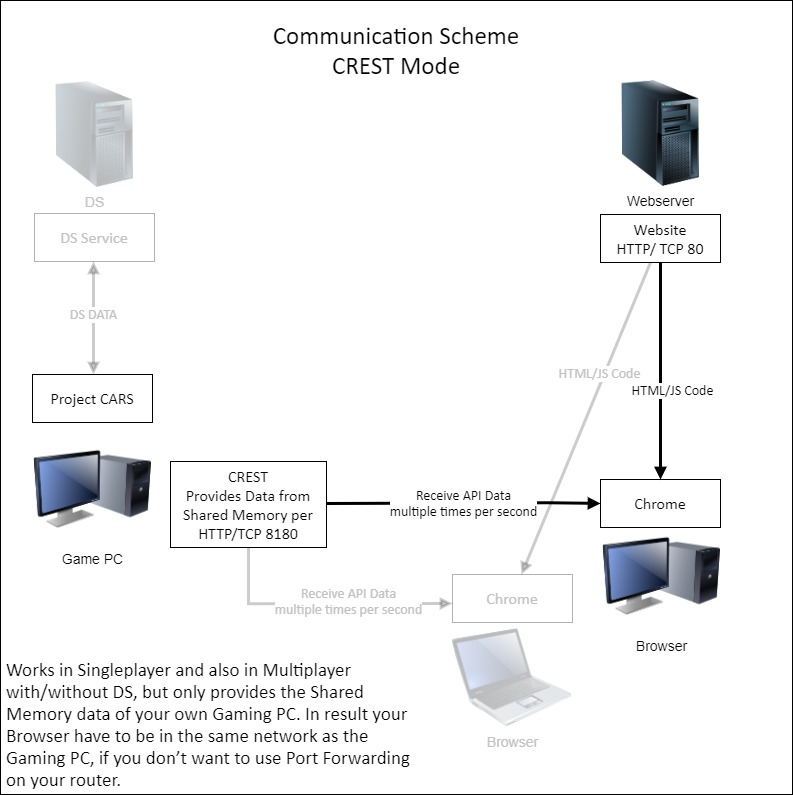

# Project CARS and Automobilista 2 liveview

## What is it?

The main goal of this project was to show information about races like you need it for TV broadcasts or for race engineers.\
This project is webbased and written in javascript. It polls the Dedicated Server API for Multiplayer sessions of Project CARS 1, 2 and Automobilista 2 to get this information, which is also the main focus. But it can also poll the CREST1/[CREST2](https://github.com/viper4gh/CREST2/blob/master/README.md) API, which provides the Shared Memory data of Project CARS 1, 2 and Automobilista 2 via HTTP.\
If you open this website it has Google Maps in background, which shows the current race track and markers of all drivers where they are.
As overlay you have some tables:
- Driver Table - shows all driver names with their position, which car they drive and timings.
- Car Table - a list of all cars, which are available in Project CARS / Automobilista 2
- Track Table - a list of all tracks, which are available in Project CARS / Automobilista 2

Further there is a recording/playback panel and some other great stuff. You can find more info about the features in the "[Nice to know](#nice-to-know)" section at the end.\
It's also important to know that javascript is executed on client side. That means your PC/Tablet/... where you start a browser and open this website is polling the Dedicated Server or CREST API via HTTP requests. Look at the [communication schemes](#communication-schemes) for more info.


## [DEMO Website](http://www.christoph-eckhardt.de/pcarsdemo/)
Open the [website](http://www.christoph-eckhardt.de/pcarsdemo/) to see a demonstration, click on "Load from URL" and choose a DEMO file.

## Usage:
- Extract a release or clone the master to your Webserver
- Rename config-sample.js to config.js and change settings with an editor, at least the API settings (ServerURL and Port) which are to be used
- If you want no watermarks on Google Maps you need a API key ([HowTo](https://developers.google.com/maps/documentation/javascript/get-api-key)). If you have one set it in the config file or use the URL parameter described below.
- Open the website in Chrome, default URL: http://[your Webserver url]/index.html
- If you get no data from DS API, look at the "[Troubleshooting](#troubleshooting)" section

**URL paramters**
- If you want to use URL parameters, set AllowUrlParams to true in config.js
- Overwriting default DS parameters:  
						http://[your Webserver url]/index.html?dsurl=[DS HTTP API url]&dsport=[DS HTTP API Port]
						
						example: http://www.xyz.com/index.html?dsurl=www.xyzDS.com&dsport=9000
				
- Overwriting default pcars2 DS parameters:  
						http://[your Webserver url]/index.html?ds2url=[DS HTTP API url]&ds2port=[DS HTTP API Port]
						
						example: http://www.xyz.com/index.html?ds2url=www.xyzDS.com&ds2port=9000
- Overwriting default AMS2 DS parameters:  
						http://[your Webserver url]/index.html?dsams2url=[DS HTTP API url]&dsams2port=[DS HTTP API Port]
						
						example: http://www.xyz.com/index.html?ds2url=www.xyzDS.com&ds2port=9000
- Overwriting default CREST parameters:   
						http://[your Webserver url]/index.html?cresturl=[IP address of gaming PC]&crestport=[CREST Port]
						
						example: http://www.xyz.com/index.html?cresturl=192.168.0.1&crestport=8080

- Overwriting default CREST2 parameters:   
						http://[your Webserver url]/index.html?crest2url=[IP address of gaming PC]&crest2port=[CREST2 Port]
						
						example: http://www.xyz.com/index.html?crest2url=192.168.0.1&crest2port=8180

- Overwriting Google Map API Key from configuration:  
						http://[your Webserver url]/index.html?api_key=[YOUR_CUSTOM_API_KEY]
						
						example: http://www.xyz.com/index.html?api_key=1234567890ABCDEF

**Supports the following Data Sources**
- Dedicated Server API from Project CARS 1, 2 and Automobilista 2 - http://forum.projectcarsgame.com/showthread.php?26520-Dedicated-Server-API, https://forum.reizastudios.com/threads/dedicated-server-tool.10141/
- CREST/CREST2 API - CREST2 (pcars2): https://github.com/viper4gh/CREST2/blob/master/README.md,  http://forum.projectcarsgame.com/showthread.php?62359-CREST2-a-k-a-CARS2-REST-API&p=1494976#post1494976 / CREST (pcars): https://github.com/NLxAROSA/CREST/tree/CREST2, http://cars-rest-api.com/ (not available anymore), 

**Default parameters**:
- dedicated server url:   mydomain.com
- dedicated server port:  9000
- pcars2 dedicated server url:   mydomain2.com
- pcars2 dedicated server port:  9000
- AMS2 dedicated server url:   mydomainAMS2.com
- AMS2 dedicated server port:  9000
- CREST server url:       localhost
- CREST server port:      8080
- CREST2 server url:      localhost
- CREST2 server port:     8180
- CREST2AMS2ServerURL:	localhost
- CREST2AMS2Port:	8180
 
## Requirements:
- Webserver where you can host this website
- client browser support: CHROME 44 or newer

## Shared some info in Project CARS Forum
- http://forum.projectcarsgame.com/showthread.php?65112-Live-stats-from-Dedicated-Server&p=1543705&viewfull=1#post1543705
- http://forum.projectcarsgame.com/showthread.php?39269-Provide-GPS-coordinates-of-all-track-reference-points-GPS-calculation-in-javascript
- http://pcars2.wmdportal.com/showthread.php?23757-pCars-1-(Aries)-Track-Feedback&p=947602&viewfull=1#post947602

## FAQ
- Why are the pits not correct counted?
The number of pits comes not directly through the API. It is counted by the application and a pit is detected if a driver enters the pits. In result the application have to run in these cases.
If the race is already running and you open the website of this application the counting begins at this moment, all prevoius pit stops are not counted. Further if you reload the website during a race the counting begins from zero again.
- What is the function of the export buttons in the driver table header?
"Export" initiates a CSV download of the currrent table view. 
"Export All" sorts the table after driver position and initiates a download of all past session results of the race weekend. There must be at least one session change during the application is running, for example from Practice to Qualifying or Qualifying to Race. If this is not the case there is nothing to download, because there is no session result.
......
- Why are the markers jerky moving?
.......
- How works the result auto export?
If the autoExport is set to true in the config.js the application automatically triggers a CSV download of all session and race results of the current race weekend. The trigger is the SessionState change from "Race" to "PostRace". The application has to run all the time over the race weekend to save all the data.

## Troubleshooting

Javascript is executed on client side. That means your browser is polling the DS HTTP API.\
If you get no data from DS or CREST check your firewall settings on client side outgoing and maybe on DS/CREST side incoming. The tool uses normal HTTP requests, which means your DS can run on another machine. For CREST2 the same, CREST2 must run on the same system where the game runs, but you can open the liveview on another system with a browser. But here the CREST2 TCP port must be open in the firewall of your game system.

liveview polls the following paths on the DS:\
/api/session/status?attributes&members&participants\
/api/list/tracks\
/api/list/vehicles \
We have no authentication implemented, which means these paths must be accessable for public in the DS server.cfg. I think tracks and vehicles are public by default, but session/status not. \
You have to add the following for httpApiAccessLevels in the DS config
```
httpApiAccessLevels : {
      "api/session/status" : "public"
}
```
You should be able to open the URL without authentication:\
http://DS_domain_name/api/session/status?attributes&members&participants. If this works, liveview should work,too.

Other relevant settings in DS config:
```
enableHttpApi : true
httpApiPort : 9000
httpApiInterface : ""
```
Another problem could be if you open the liveview via HTTPS on your webserver, because the DS is polled via HTTP. In this case your Chrome prevents this and shows an icon on the right side of the address field.\
Then you can click on it and "Load unsafe scripts".

## Node Proxy
Liveview is written in javascript and executed on client side. If bigger communities want to use such a tool many clients would query the HTTP API. We don't know how many connections the DS HTTP API webserver can handle and if there could be a negative effect on the DS performance itself.\
For this case we implemented a small Node Proxy which simply queries the HTTP API and provides it again as HTTP webserver.\
Further the Node Proxy is supporting the basic authentication which is default activated in the DS HTTP API server.cfg if you request the path /api/session/status.\
You can find the Node Proxy in the folder "liveview-node".\
**Requirements:** Linux or Windows with installed Node.js ([Download](https://nodejs.org/en/download/)). The basic installation of node.js is enough, because we only use the HTTP module and no other extra modules.

**Usage:**
- the Node Proxy can run on a seperate system, but also on the server where the DS is running and also on the webserver where liveview is installed
- copy the folder "liveview-node" to the system where you want to start it
- rename config-sample.js to config.js and change settings with an editor, you have to set the APIMODE and URL/Port for this APIMODE
- start the Node Proxy with: node node.js, the node proxy must have access to the DS HTTP API on default port 9000 TCP
- the Node Proxy provides the data as webserver on port 8080, which is changeable in the config file
- now go to the liveview config file, set APIMODE to the same mode which you configured in the Node proxy config, set "use_node" to "true" and set the "nodeServerURL" (maybe also "nodePort" if you changed it in the Node Proxy config)
- open liveview in Chrome, your Client where liveview is running must have access to the Node Proxy on default port 8080 TCP
- (optional) you can restrict the DS HTTP API access to the Node Proxy and activate the authentication in the DS config again, because without Proxy there was the URL path "api/session/status" for public needed in the DS config under httpApiAccessLevels (liveview itself is not supporting authentication), Node Proxy supports authentication and you can remove the line there (you have to add user and password from DS API config to the Node Proxy config), further you could restrict the access in the httpApiAccessFilters to the ip address of the Node Proxy for example

**Additional Info:**\
The Node Proxy can used for the CREST API modes, too. But the normal use case is in my opinion in combination with the DS modes.

## Communication Schemes




## Nice to know

- You can record a session. Use the "Start Recording" switch for starting and stopping the record. After stopping click the "Export" button. For long sessions this takes some time, because the record is saved in RAM of the Browser process. With clicking on export a zip file is generated. This zip file can be loaded with the Button "Datei auswählen"/"Select File" (in my bowser it is german). You maybe have to switch to DEMO API Type, if it is not switched automatically.

- There are some records already in for demonstration. Click on Button "Load from URL" and choose a record. 

- The Pit information during a race is no info from DS. It is detected by liveview, if a participant state changes to "EnteringPits". That means this info is only correct, if liveview is running all the time and receives these state changes. If you open liveview during a race, it can only detects from this moment on.

- Same for the "Export All" Button in the Driver Table. liveview collects all session results for the complete race weekend and if you click on the button you get a csv and/or pdf (configurable via config.js) with all finished sessions till this moment. But liveview have to run from beginning of the first session. I hope this still works, I haven't test it for a long time and there were already some DS changes in the past. Further this feature only works in DS mode.

- If you open the track table, you can use the left mouse button to select a track, the map then jumps to it, left mouse button on the selected row jumps back again. Fictional tracks have only a white background. For Sakitto GP are border lines available for example (there is also a recording for Sakitto GP), but for the most others not. These lines must be recorded with a car on track, which needs a lot of time and time is short - sorry.

- You can click on the column headers for sorting the table

- DS settings window: with the DisplayDurationCorrector you can manipulate the smoothness of the marker moving. WorkerDelay changes the time in ms between every polling. I think liveview needs at least 100 ms calculation time for one run. That means if the worker delay is 300ms for example, the time between every run is 400ms. The DS updates the data only every half seconds. It makes no sense to poll it more often. In this case you only get same data again. The color driver objects dropdown menu changes the marker colors, Top 3 is gold/silver/bronze color, but you can also change it to same class, then all cars of a vehicle class have the same marker color. Driver labels can be changed to show the complete driver name or only the position on the markers.

- If you filter the driver table for "GT3" for example, only the GT3 car markers are completely shown, all others are transparent. You can change the strength with the "Hidden driver opacity" slider in the DS settings window. If you set it to 0 all other cars are completely hidden.

- You can use the map in fullscreen with the icon in the upper right of the map. In this case you see only the map and the markers.

- In the config.js file you can change many defaults, which windows are default shown, tables default collapsed or not, default API mode (DS2 for example), marker colors, Export Type (csv/pdf), etc.

- Chrome seems to have a problem, if you have liveview open, switch to another browser tab and later back again. Then the liveview tab freezes, normally it catches itself after several seconds. But better is you don't switch to other tabs. Maybe opening a new instance of Chrome instead of new tabs work. Further minimizing the Chrome window has the same effect.
